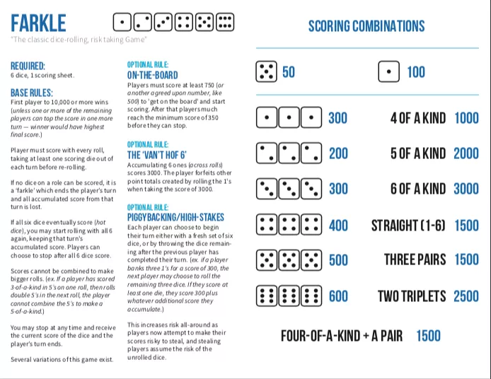
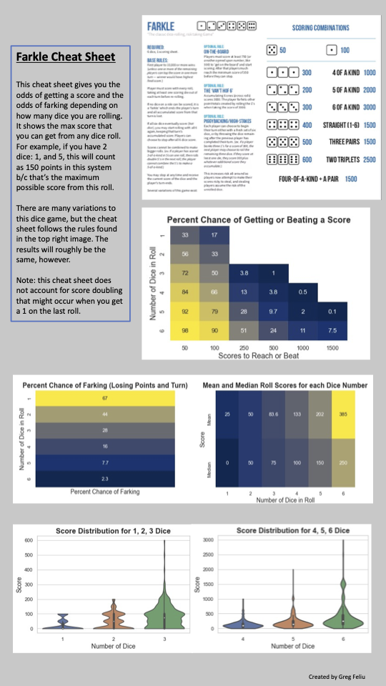

# Farkle Move Analyzer

## What is Farkle?

Farkle (also called Fark) is a multi-player dice game. In this game, one tries to score more points than the other players. Each player must roll all of the dice available to them and the need to score in order to continue playing in that round. After each roll, the player must remove one die, collect the points that the die gives them. If no point-collecting values are rolled, the player loses any points accumulated in that turn (called "farks"), and the next player rolls. If they score, however, they continue the roll-collect-remove process until there is only one dice left. If they score with the last dice, they get all 6 dice back and continue playing. For the full rules of the game, see the following graphic: 

 

## Description 

In this project, **I seek to understand more about the probabilities of both scoring points the number of points that can be scored on each roll**. The main findings can be found in the following graphic:

As you can see, rolling more dice gives you a much larger possibility of both scoring (i.e.: not farking) and winning lots of points. This is due to the increased likelihood of rolling a single point scoring die (1 or a 5) but also due to the increased likelihood of scoring a combo roll (e.g.: 2, 2, 2).

Using these findings, one can more have a more complete understanding of the game and what the best move is at any turn. Let's see how this works in practice:
Say the roll has two 5s, and no other point-scoring dies. The player can choose to pick up one or more dice when more than one point-scoring die is on the board. Should the player pick up one or both 5's? Which outcome will net more points in the future? Using the knowledge gained in this project, we can show the chance of farking, and the mean and median scores for rolling with 4 and 5 dice. The difference in medians is 50 points, meaning that in most scenarios, the person will roll at least a 5 in the next roll if they remove one 5. The difference in means is more than 50, meaning that on average rolling with 5 dice will score even more than 50 more points than rolling with 4 dice. Lastly the chance of farking is reduced by 8.3% by rolling with 5 dice instead of 4. All 3 ways of analyzing the choice show that only removing one five is the optimal choice.

## Future Work
Developing and testing the optimal strategy in the game is the logical next step. We have all of the information we need, all we need to do is use it correctly and the game could be impossible to lose! To reach this goal, it seems that the player (or even AI) will need to find the optimal level of risk in their gameplay. If they have one dice left, is it better to keep the points you have or to risk it all? Testing which strategy nets more points would be fascinating to anyone involved with the game. Perhaps reinforcement learning could help discover this ideal mix of risk and reward. 

One aspect of the game that hasn't been considered thus far is the "strength of the board." How many points do my opponents have? How close are they to winning it all? I would be fascinated to see how the knowledge gained from this project could be used in conjunction with the number of points among the other players. How different is the strategy between the beginning and end of the game? 

Lastly, if it were possible to determine the optimal strategy for Farkle, how would it differ from "human" play? What are humans doing that is holding back their play? Are we too aggressive? Too passive? This is not some far off dream, either, many games have been "solved" in some capacity: chess and go with [AlphaZero](https://en.wikipedia.org/wiki/AlphaZero), poker with [PioSOLVER](https://www.piosolver.com), and many others. Only testing and experimentation will reveal the answer.

## Technologies Used
- Jupyter Notebook
- Python
    - Seaborn
    - itertools
    - fractions
    - NumPy
    - Matplotlib
