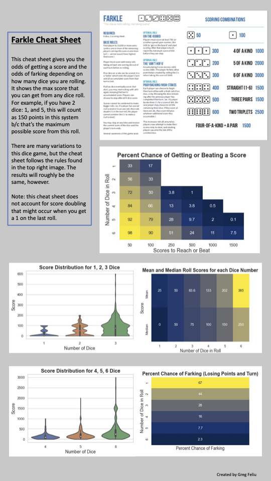

# Farkle Move Analyzer

## Description

Farkle (also called Fark) is a multi-player dice game. In this game, one tries to score more points than the other players. Each player must roll all of the dice available to them and the need to score in order to continue playing in that round. After each roll, the player must remove one die, collect the points that the die gives them. If no point-collecting values are rolled, the player loses any points accumulated in that turn (called "farks"), and the next player rolls. If they score, however, they continue the roll-collect-remove process until there is only one dice left. If they score with the last dice, they get all 6 dice back and continue playing. For the full rules of the game, see the following graphic: 

 

In this project, **I seek to understand more about the probabilities of both scoring points the number of points that can be scored on each roll**. The main findings can be found in the following graphic:

As you can see, rolling more dice gives you a much larger possibility of both scoring (i.e.: not farking) and winning lots of points. This is due to the increased likelihood of rolling a single point scoring die (1 or a 5) but also due to the increased likelihood of scoring a combo roll (e.g.: 2, 2, 2).

Using these findings, one can more have a more complete understanding of the game and what the best move is at any turn. For example, if one rolls 6 dice and the only point scoring dice are two 5's, should the player pick up both 5's and collect 100 points or should they only pick up one? Which option will net more points? In this case, we notice the difference in mean and median scores between rolling 5 dice and rolling 4 dice. The difference in medians is 50 points, meaning that in most scenarios, the person will roll at least a 5 in the next roll if they remove one 5. The difference in means is more than 50, meaning that on average rolling with 5 dice will score even more than 50 more points than rolling with 4 dice. Lastly the chance of farking is reduced by 8.3% by rolling with 5 dice instead of 4. All 3 ways of analyzing the choice show that only removing one five is the optimal choice. 

## Future Work
It would be fascinating to see an AI use reinforcement learning to identify the optimal strategy. The AI could take into account the scores of the other players, the number of points to win the game, etc. in conjunction with the expected number of points scored and other insights from this work. The optimal strategy for *any* player decision in this game could be made with the maximum accuracy possible.

Actually developing the optimal strategy and comparing it to actual gameplay would also be extremely fascinating. How do they differ? We would discover many interesting aspects of human behavior in this effort. Are humans too risk averse while playing this game? How much do they differ to the optimal strategy? 

## Technologies Used
- Jupyter Notebook
- Python
    - Seaborn
    - itertools
    - fractions
    - NumPy
    - Matplotlib
